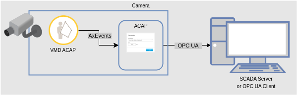
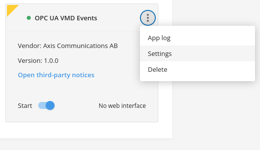
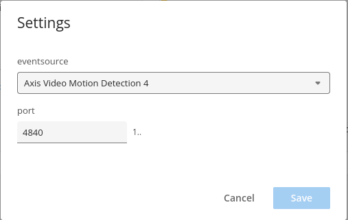
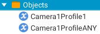

*Copyright (C) 2023, Axis Communications AB, Lund, Sweden. All Rights Reserved.*

# OPC UA VMD Events ACAP

This repository contains the source code to build a small [ACAP version 3](https://help.axis.com/acap-3-developer-guide) application that exposes
[AXEvent](https://www.axis.com/techsup/developer_doc/acap3/3.5/api/axevent/html/index.html) compatible scenario events (alarm status)
through [OPC UA](https://en.wikipedia.org/wiki/OPC_Unified_Architecture) ([open62541](https://open62541.org/)).

*Please note that even if this ACAP would fit right into your usecase, its
purpose is above all to serve as an example and boilerplate rather than being
ready for production.*

## Supported Events

The ACAP's backend can subscribe to the following ACAPs:

- [Axis Fence Guard](https://www.axis.com/products/axis-fence-guard)
- [Axis Loitering Guard](https://www.axis.com/products/axis-loitering-guard)
- [Axis Motion Guard](https://www.axis.com/products/axis-motion-guard)
- [AXIS Video Motion Detection (VMD) 4](https://www.axis.com/products/axis-video-motion-detection)

## ACAP architecture



## Usage

Requires any of the compatible video motion analytics ACAPs referenced above, to be available on the device.

- create and enable a profile in the analytics ACAP ([VMD 4 profile example](https://help.axis.com/en-us/axis-video-motion-detection-4#how-to-work-with-profiles)).
- Then, install and configure the `OPC UA VMD Events` ACAP to pick up the chosen analytics ACAP events.




The exposed event profile names are of the following form: `CameraXProfileY` (i.e. `Camera1Profile1`, `Camera1Profile2`, etc.).
The special event `CameraXProfileANY` will always fire alongside any other profile event firing.

The OPC UA object view for a single analytics profile configured, looks like this:



The OPC UA Server port (default is 4840) can also be set through the ACAP's settings.

## Build

### Using the native ACAP SDK

```sh
# With the environment initialized, use:
acap-build .
```

### Using Docker and the ACAP SDK container

The handling of this is integrated in the [Makefile](Makefile), so if you have Docker on your computer all you need to do is:

```sh
make dockerbuild
```

or perhaps build in parallel:

```sh
make -j dockerbuild
```

If you do have Docker but no `make` on your system:

```sh
# 32-bit ARM
DOCKER_BUILDKIT=1 docker build --build-arg ARCH=armv7hf -o type=local,dest=. .
# 64-bit ARM
DOCKER_BUILDKIT=1 docker build --build-arg ARCH=aarch64 -o type=local,dest=. .
```

## License

[Apache 2.0](LICENSE)
