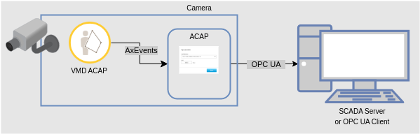
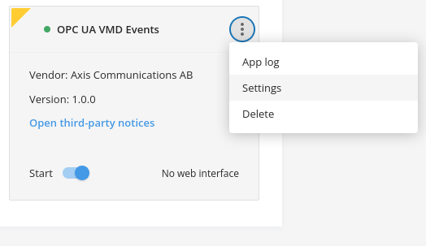
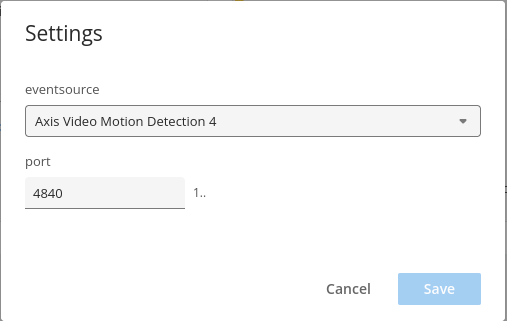
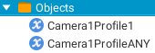

*©2023 Axis Communications AB. AXIS COMMUNICATIONS, AXIS, ARTPEC and VAPIX are registered trademarks of Axis AB in various jurisdictions. All other trademarks are the property of their respective owners.*

<!-- omit from toc -->
# OPC UA VMD Events ACAP

<!-- omit from toc -->
## Table of contents

- [Overview](#overview)
- [Supported events](#supported-events)
- [Example Use Cases](#example-use-cases)
- [ACAP architecture](#acap-architecture)
- [Usage](#usage)
- [Build](#build)
  - [Using the native ACAP SDK](#using-the-native-acap-sdk)
  - [Using Docker and the ACAP SDK container](#using-docker-and-the-acap-sdk-container)
- [License](#license)

## Overview

This repository contains the source code to build a small [ACAP version 3](https://help.axis.com/acap-3-developer-guide) application that exposes
[AXEvent](https://www.axis.com/techsup/developer_doc/acap3/3.5/api/axevent/html/index.html) compatible scenario events (alarm status)
through [OPC UA](https://en.wikipedia.org/wiki/OPC_Unified_Architecture) ([open62541](https://open62541.org/)).

> [!NOTE]
> Please note that even if this ACAP would fit right into your use case, its
> purpose is above all to serve as an example and boilerplate rather than being
> ready for production.

## Supported events

The ACAP application's backend can subscribe to the following ACAP applications:

- [AXIS Fence Guard](https://www.axis.com/products/axis-fence-guard)
- [AXIS Loitering Guard](https://www.axis.com/products/axis-loitering-guard)
- [AXIS Motion Guard](https://www.axis.com/products/axis-motion-guard)
- [AXIS Video Motion Detection (VMD) 4](https://www.axis.com/products/axis-video-motion-detection)

## Example Use Cases

> The following examples assume that you have a [SCADA](https://en.wikipedia.org/wiki/SCADA) (Supervisory
Control And Data Acquisition) system or a [PLC](https://en.wikipedia.org/wiki/Programmable_logic_controller) (Programmable Logic Controller) system with OPC UA as the communication protocol and you want to take advantage of the AXIS device capabilities to enrich or complement your operations.

With **AXIS Fence Guard** you can monitor objects/persons crossing a line (virtual fence) with a predefined direction and get an actionable event in your SCADA/PLC.

For example:

- get a SCADA alarm every time an object passes through a checkpoint, like on a conveyor belt system
- shutdown or start a PLC process if a person enters an area through a predefined and barred entry point, like approaching the hot side of an exhaust system
- count objects that move in opposite directions (incoming/outgoing) and graph their totals in a SCADA Screen

With **AXIS Video Motion Detection** or **AXIS Motion Guard**, you can monitor motion (or absence of motion) in a predefined area and and get an actionable event in your SCADA/PLC.

For example:

- get a SCADA alarm every time an object moves within a specific part of the area, like objects falling off the conveyor belt on the wrong side
- shutdown or start a PLC process if a person enters (or leaves) a predefined area, like a truck loading/unloading platform
- get a SCADA alarm if a machine with moving parts, like a conveyor belt or a motor, stops (or starts) working
- get a SCADA alarm if a monitored item starts (or stops) spewing liquid, like a liquid overflow outlet
- get a SCADA alarm if an object is swaying too much, like a tree close to a power line on a windy day

With **AXIS Loitering Guard** you can also monitor if a person has exceeded some predefined time being present in an area and thus, get an alarm in your SCADA/PLC.

> [!WARNING]
> Please note that any analytic process may produce false positives or negatives and the system designer has to account for those occurrences.

## ACAP architecture



## Usage

Requires any of the compatible video motion analytics ACAP applications referenced above, to be available on the device.

Create and enable a profile in the analytics ACAP ([VMD 4 profile example](https://help.axis.com/en-us/axis-video-motion-detection-4#how-to-work-with-profiles)). Then, install and configure the **OPC UA VMD Events** ACAP to pick up the chosen analytics ACAP events.




The exposed event profile names are of the following form: `CameraXProfileY` (i.e. `Camera1Profile1`, `Camera1Profile2`, etc.).
The special event `CameraXProfileANY` will always fire alongside any other profile event firing.

The OPC UA object view for a single analytics profile configured, looks like this:



The OPC UA Server port (default is 4840) can also be set through the ACAP's settings.

## Build

### Using the native ACAP SDK

```sh
# With the environment initialized, use:
acap-build .
```

### Using Docker and the ACAP SDK container

The handling of this is integrated in the [Makefile](Makefile), so if you have Docker on your computer all you need to do is:

```sh
make dockerbuild
```

or perhaps build in parallel:

```sh
make -j dockerbuild
```

If you do have Docker but no `make` on your system:

```sh
# 32-bit ARM
DOCKER_BUILDKIT=1 docker build --build-arg ARCH=armv7hf -o type=local,dest=. .
# 64-bit ARM
DOCKER_BUILDKIT=1 docker build --build-arg ARCH=aarch64 -o type=local,dest=. .
```

## License

[Apache 2.0](LICENSE)
